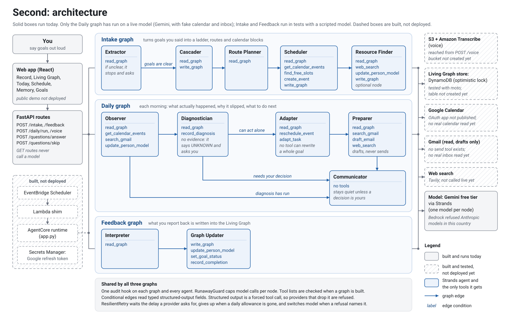
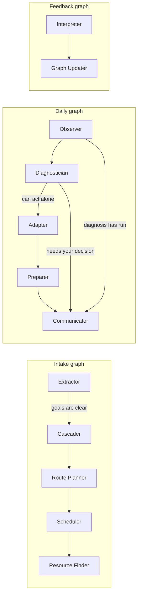
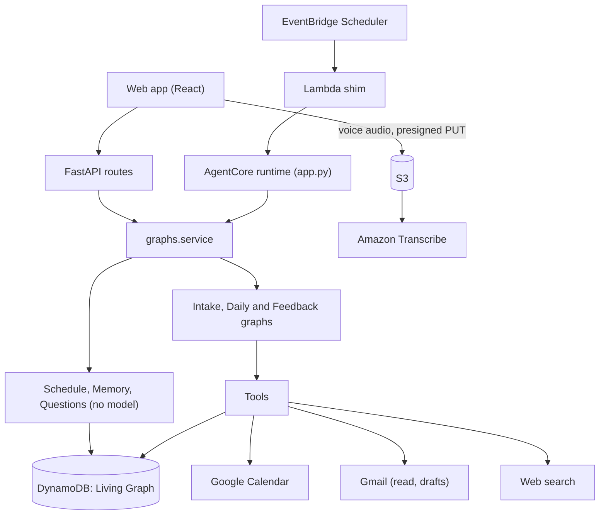

# Second

Tell it what you want. It works out how to fit it into your life, and keeps it moving.

Second is a personal execution agent for people running several long-term goals at once. You say
your goals out loud. Second breaks them into a ladder of smaller goals, plans a route for each,
puts the work into your calendar, and checks every morning what actually happened.

It does everything it can do without you, then hands you the smallest possible piece. When a leave
request is holding up a trip, Second drafts the email and leaves it in Gmail for you to send.

Built on the [Strands Agents SDK](https://github.com/strands-agents/sdk-python) for the AWS
"Agents for Humans" hackathon.

## What it does

**Intake.** You speak or type a goal. Second extracts the goals in it, walks long ambitions down to
something that fits a calendar slot ("build a company that outlives me" becomes this year, this
month, this week), plans a route for each, and fits the work around the goals you already have. If
what you said is too vague to plan on, it asks instead of guessing.

**The daily run.** Each morning five agents read yesterday against the plan. The Observer compares
the calendar and inbox with what was scheduled. The Diagnostician explains each slip with a quoted
piece of evidence, or says it cannot tell. When Second can fix the problem itself, the Adapter
changes the plan and the Preparer gets the next step ready up to the last click. The Communicator
decides whether anything is worth telling you. Most mornings nothing is, and Second stays quiet.

The demo world has a gym session at 18:00 that keeps losing to a weekly meeting with nine
attendees. Second finds the declined invites, sees the meeting belongs to someone else, and moves
the gym to 07:00. It tries to move the meeting too, and the calendar tool refuses. That refusal is
in the audit log.

**Schedule.** Today and the next six days. Blocks already in the plan show as placed. For days with
nothing placed, Second proposes blocks from each route's own rhythm ("weekday mornings 08:00") and
labels them as suggestions that are not in your calendar. It will not propose a time you have
repeatedly abandoned, and it lists what it refused and why.

**Memory.** What to keep in mind today, gathered from separate sources: your calendar, your email,
and the plan itself (deadlines at risk, drafts waiting on you, rules you set). Each item quotes where
it came from. Each source reports whether it could be read, so an empty calendar and a disconnected
one look different. Adding a source means writing one class, registering it in
`default_sources`, and adding its name to `MemorySourceName` so the web app's types stay exact.

**Questions.** Every two days Second asks what you want to get done this week, and every three days
what you want this month, each with "by when?". It anchors the question to a goal that has nothing
planned at that horizon. Your answer goes through intake like anything else you say.

## What it will not do

- Send email. It writes drafts.
- Delete calendar events.
- Move an event you do not own. The calendar tool refuses, whatever the model asks for.
- State a cause it cannot quote. A diagnosis with no evidence is downgraded to `UNKNOWN` by the
  data model, and the user is asked.
- Run a model when you open a screen. Today, the schedule and memory are built from stored data
  plus read-only calls such as fetching today's calendar. Only an explicit run calls a model.

## Architecture



Solid boxes run today. Dashed boxes are written and tested offline but not deployed or connected.

Three Strands graphs share one store and one set of tools.





The Living Graph is one DynamoDB item per user holding goals, routes, tasks, slip history and a
person layer (slots you keep, slots you abandon, standing rules). Writes use an optimistic lock on a
version number, so two nodes writing in one run cannot overwrite each other silently.

### How the Strands SDK is used

- Each graph is a `GraphBuilder` with conditional edges. The Daily graph routes on a typed field of
  the Diagnostician's structured output.
- Structured output is how every node hands a typed result to the next. Strands implements it as a
  forced tool call, so providers that accept a forced tool choice and then ignore it are refused
  when the model is built (`graphs/composition.py`).
- Each agent receives only the tools it declares. `assert_privileges` checks this when the graph is
  built. The Adapter can change a task's time, title and cadence through `adapt_task`, and has no
  tool that can rewrite a whole goal, so it cannot erase slip history.
- One audit hook is registered on the graph and on every agent. It keeps a single ordered log of node
  spans and tool calls, including refused ones and the reason.
- `RunawayGuard` caps model calls per node. `ResilientRetry` waits the delay a provider asks for.
  If the provider asks for more than about a minute, the daily allowance is gone, so it stops
  waiting. When a refusal names the model rather than the account, it switches to another model.
- Run-wide state lives under one namespace in `invocation_state`, because the SDK writes its own
  keys into the same dictionary.

### Least privilege

Each agent module declares `REQUIRED_TOOLS` and `OUTPUT_MODEL` (`src/second/agents/`). This is the
whole list.

| Graph | Agent | Tools | Typed output |
|---|---|---|---|
| Intake | Extractor | `read_graph` | `ExtractionResult` |
| Intake | Cascader | `read_graph`, `write_graph` | `CascadeResult` |
| Intake | Route Planner | `read_graph` | `RoutePlan` |
| Intake | Scheduler | `read_graph`, `get_calendar_events`, `find_free_slots`, `create_event`, `write_graph` | `ScheduleDecision` |
| Intake | Resource Finder | `read_graph`, `web_search`, `update_person_model`, `write_graph` | None |
| Daily | Observer | `read_graph`, `get_calendar_events`, `search_gmail`, `update_person_model` | `ObservationReport` |
| Daily | Diagnostician | `read_graph`, `record_diagnosis` | `Diagnosis` |
| Daily | Adapter | `read_graph`, `reschedule_event`, `adapt_task` | None |
| Daily | Preparer | `read_graph`, `search_gmail`, `draft_email`, `web_search` | `PreparedAction` |
| Daily | Communicator | none | `BriefJudgement` |
| Feedback | Interpreter | `read_graph` | `FeedbackResult` |
| Feedback | Graph Updater | `write_graph`, `update_person_model`, `set_goal_status`, `record_completion` | None |

The Diagnostician has no calendar or email tool, so it never reads raw calendar events or email;
it works from the Observer's report and the graph. The Communicator has no tools at all and cannot
look anything up to pad a quiet morning. The Adapter has no tool that can rewrite a whole goal, so
it cannot erase slip history while it moves a task. When a graph is built, `assert_privileges`
(`src/second/core/deps.py`) compares the tools each agent was given with its declaration and
refuses to build if one is missing or an extra one was injected.

## Status on 13 September 2026

| Part | State |
|---|---|
| Daily graph on a live model | Seven end-to-end runs on the Gemini free tier. The Diagnostician cited the real evidence and returned `UNKNOWN` for the slip nothing explained. These runs used the fake calendar and inbox and an in-process DynamoDB. |
| Web app | Runs on example data generated from the real graph code, labelled "fixtures" on screen. Hosted at https://second-blush-ten.vercel.app. |
| Google Calendar and Gmail | Tools, scopes and consent screen done. The OAuth app is not yet published and no token exists, so nothing has read a real calendar. |
| AWS resources | Table, bucket and IAM policy are scripted (`scripts/bootstrap_aws.py`, `deploy/iam-policy.json`). Not yet created. |
| AgentCore and the morning schedule | Entrypoint (`app.py`) and trigger (`deploy/lambda_shim.py`) written. Not deployed. |
| Model provider | Gemini free tier verified. Groq pending a probe of forced tool choice. Bedrock refuses Anthropic models for this account's country. |

## Testing it as a judge

The quickest look needs nothing installed: https://second-blush-ten.vercel.app runs the web app on the same example data,
labelled "fixtures". Open it at the root; screens switch from the rail, not by URL.

Three ways in, fastest first. The first two need no accounts: no AWS, no Google, no model key.

**1. The web app on example data.** Needs Node 24.

```bash
cd web
npm ci
npm run dev
```

Open the localhost URL that Vite prints. The navigation rail shows `fixtures`, meaning every screen
runs on data produced by running the real graphs with a scripted model, not on a live backend.
The screens are Record, Living Graph, Today, Schedule, Memory and Goals.

**2. The offline test suite.** Needs Python 3.12 and uv.

```bash
uv sync
uv run pytest -q
```

DynamoDB runs in-process through `moto`, Google is replaced by fake connectors, and the model is
scripted, so no credentials are needed.

**3. A live Daily run.** Needs an account with one model provider. Copy `.env.example` to `.env`,
set `SECOND_MODEL_PROVIDER` and that provider's key (the recorded runs used `gemini`), then:

```bash
uv run python scripts/live_daily.py
```

The five Daily agents run on the real model against the demo world. The calendar, inbox and web
search are fakes and DynamoDB runs in-process, so this still needs no AWS or Google account. The
things to watch are whether the Diagnostician quotes evidence from the Observer's report or returns
`UNKNOWN`, and whether the Preparer stops at a draft.

## Running it

Requires Python 3.12 through [uv](https://docs.astral.sh/uv/) and Node 24.

```bash
uv sync
uv run pytest -q
```

The web app on example data:

```bash
cd web
npm ci
npm run dev
```

A live Daily run against a model. Set `SECOND_MODEL_PROVIDER` and that provider's key in `.env` first; `.env.example` lists them, and the recorded runs used `gemini`.

```bash
uv run python scripts/live_daily.py
```

Check whether a provider honours forced tool choice before building on it:

```bash
uv run python scripts/probe_provider.py https://api.groq.com/openai/v1 openai/gpt-oss-120b GROQ_API_KEY
```

### Against real accounts

Run in this order. Set `SECOND_DEMO_TODAY` in the shell first, because the demo world and the
seeded calendar both read it when they load.

1. `uv run python scripts/bootstrap_aws.py` creates the table and bucket.
2. `uv run python scripts/seed_graph.py --apply` writes the demo world into the table.
3. `uv run python scripts/authorize_google.py --role runtime`, then the same with `--check`.
4. `uv run python scripts/authorize_google.py --role seeder`.
5. `uv run python scripts/seed_demo.py --zone <IANA zone> --smoke --apply`, then without `--smoke`.

The Google OAuth app must be published before step 3. A refresh token issued while the app is in
Testing expires after seven days.

## Demo build

`npm run build:demo` builds a static bundle that runs on the generated example data with no API
behind it. This is what the Vercel deployment builds (`web/vercel.json`), live at https://second-blush-ten.vercel.app.
`npm run fixtures` regenerates that data by running the real graphs with a scripted model.

## Tests

The suite runs offline: `moto` for DynamoDB, fake Google connectors, and a scripted model. Safety
guards are mutation-checked: each one is broken on purpose to confirm a test fails, then restored.

## How this was built

Second was built from 10 to 14 September 2026, inside the hackathon's submission period, by one
founder, Patrick Oghenejivwe, in Nigeria. He worked with an AI coding assistant, Claude Code, and
the commits it helped write carry a `Co-Authored-By: Claude` line. The first commit is dated
10 September 2026.

No code from an earlier project is in this repository. Everything not written here is an
open-source library, declared in `pyproject.toml` and `web/package.json`. Google Calendar, Gmail,
web search and the model providers are called through their published APIs and used under their
terms.

The model provider changed during the build. Amazon Bedrock refused Anthropic models for this
account's country, so the live runs moved to the Gemini free tier. Its per-model limits, five requests a
minute and twenty a day, are why each node runs on its own model. Those runs exposed bugs that were then
fixed: the retry ladder ignored Gemini's stated retry delay, and the Adapter ran out of output
tokens retyping a whole goal, which is why `adapt_task` exists.

## Licence

MIT. See [LICENSE](LICENSE).
